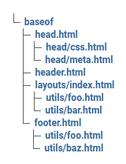
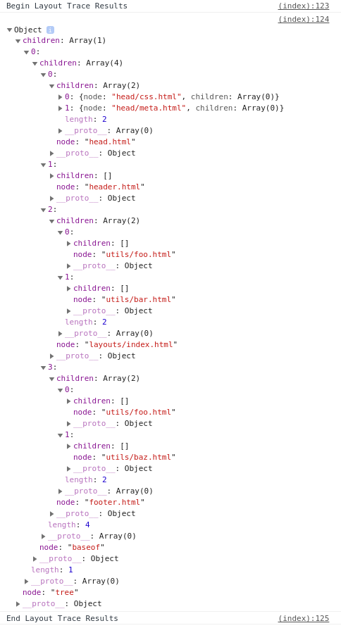

## What 

A way to trace which layout files are being used to generate a specific page

Ref: https://discourse.gohugo.io/t/server-option-to-output-templates-used/32042/4

I was working on a theme component idea about this last year. Real life however got in the way, and I forgot all about it until the topic above.


## Why

We don't currently have a way to trace the templates being called (See: https://discourse.gohugo.io/t/template-call-graph/32114 ) built in to Hugo.

## How 

**tldr**

We trace the layouts being generated by appending opening and closing tags to a `.Scratch` variable. Then some JS magic converts this into a tree-like structure, which we can then render, either onto the DOM, or logged to the console.

### Details:

For each layout file we are interested in being traced, we add a pair of lines: an opening tag and a matching closing tag.

```
{{ .Scratch.Add "trace" (slice "<baseof>") }}

... Usual Hugo things ...

{{ .Scratch.Add "trace" (slice "</baseof>") }}
```

Note the "syntax": `<foo> </foo>`

This can be as detailed as you want it to be: you can choose to only annotate the "main" layout files, i.e. `index.html`, `list.html`, `single.html` etc., 
or annotate even the smallest partial file.

Then somewhere in your `baseof` file, after the closing annotation, you call the trace partial/s:

```
{{ partial "__layouttrace/generatetrace" . }}
{{ partial "__layouttrace/rendertrace" . }}
```

If printing to `console.log` is sufficient for your use, you can call only the first partial. The second partial renders a tree in the form of a `ul` to the DOM.





---

Repo here: https://github.com/pointyfar/layouttrace

Demo here: https://nervous-ptolemy-2cd2ed.netlify.app/

Demo repo: https://github.com/pointyfar/layouttrace-demo

---
### Lorem text follows

Culpa esse culpa amet Lorem commodo. Sint sint voluptate amet excepteur velit voluptate ut anim ut enim ipsum amet. In deserunt officia fugiat velit labore amet reprehenderit. Occaecat exercitation pariatur reprehenderit do ex laboris et quis ut aliqua sit fugiat occaecat sit.

Fugiat exercitation minim nostrud aliquip cillum cupidatat pariatur nostrud sit do voluptate minim duis. Non qui tempor ea esse ut minim. Nostrud officia velit ullamco reprehenderit magna Lorem aute non adipisicing laborum proident irure. Dolore nostrud duis ea minim occaecat in aute consequat dolore officia consectetur consectetur consequat. Esse adipisicing ex aliquip reprehenderit et ullamco ipsum aliqua non aliquip esse. Consequat proident in occaecat cillum sit ea adipisicing tempor aliqua proident culpa est fugiat in. Voluptate aliqua ipsum excepteur duis esse culpa culpa officia incididunt elit deserunt ea quis do.

#### Content ends here.